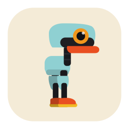
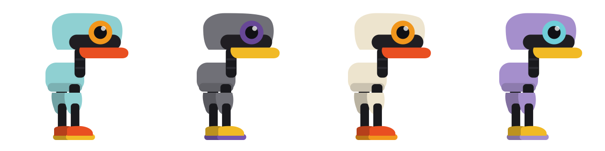
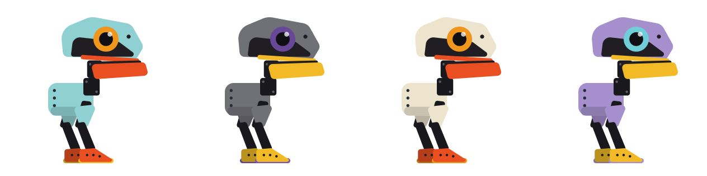
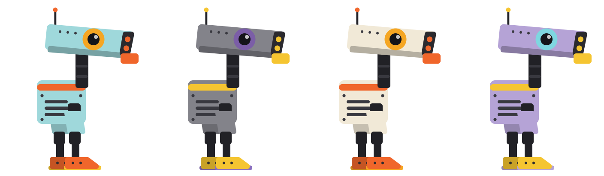
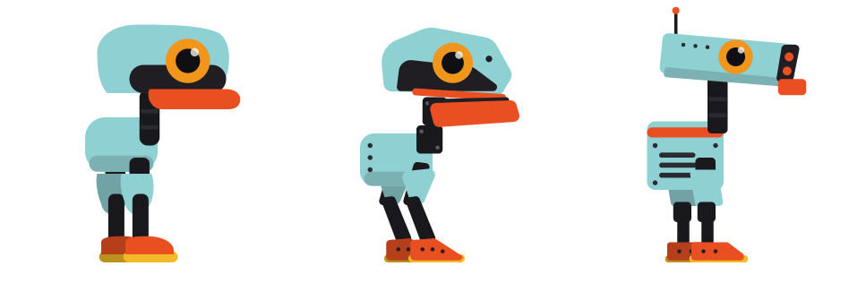

#  Micropal

A tiny desktop companion for macOS, lovingly inspired by [Pollen Robotics' Microduck](https://pollen-robotics.com/microduck/) — the 25 cm open-source biped robot you train with reinforcement learning.

This is the digital sibling: a flat-vector cartoon duckbot that lives at the bottom of your screen. It walks above your Dock, blinks, pecks at the ground, kicks, sits down, roller-skates, occasionally falls flat on its back and scrambles up again — all mirroring the real robot's trained moves.

## The roster

Three designs, four official colorways (Teal, Grey, Cream, Lavender) — plus fully custom colors.

**Classic** — the original bubbly cartoon:



**Faithful** — angular clamshell head and crouched digitigrade stance, closest to the real robot:



**Boxbot** — slab head, antenna, and grille chest, inspired by a certain family of theme-park droids:



Side by side in Teal:



## Features

- **Walks along the bottom of your screen**, on top of your windows, without ever stealing focus or blocking clicks outside its body
- **Randomized behaviors**: walk, idle & look around, peck, sit & stand, kick, roller-skate, fall over & get back up
- **Interactions**: click it for a reaction (hop, kick, or a long look at you), pick it up with the mouse (it flails!) and drop it, and it watches your cursor
- **Three designs**: Classic, Faithful, and Boxbot (see the roster above)
- **Customizable** via the menu bar duck: the four official colorways or fully custom colors, size, activity level, and per-behavior toggles
- **Launch at login**, pause/resume, zero permissions required, ~5 MB, native Swift

## Install (for recipients)

1. Open `Micropal.dmg` and drag the app to Applications.
2. **First launch**: right-click the app → **Open** → **Open**. (The app is ad-hoc signed, not notarized — this one-time step tells Gatekeeper you trust it. On macOS 15+ you may instead need System Settings → Privacy & Security → "Open Anyway".)
3. Look for the duck in your menu bar and at the bottom of your screen.

## Build from source

Requires Xcode (or the Command Line Tools) on macOS 13+.

```bash
swift run Micropal                # run directly, for development
Scripts/build-app.sh              # build build/Micropal.app
Scripts/make-dmg.sh               # package dist/Micropal.dmg + .zip
```

Add `--universal` to `build-app.sh` for a combined Apple silicon + Intel binary.

Handy dev flags:

```bash
.build/debug/Micropal --debug                       # log state every 2s
.build/debug/Micropal --render-duck out.png 512 2   # render colorway #2
.build/debug/Micropal --render-duck out.png 512 0 1 # colorway #0, style #1
```

## How it works

Native AppKit, no dependencies. The duck is a CAShapeLayer tree built from the active style's geometry spec (`Duck/DuckStyle.swift` — anchors, part paths, and a hit-test silhouette per design), posed procedurally at 60 Hz by a pure-math state machine (`Engine/DuckStateMachine.swift`), so every style shares the full animation set. It lives in a small borderless transparent window that follows the duck; a silhouette hit-test makes only the duck's body clickable. Cursor awareness polls `NSEvent.mouseLocation`, which needs no accessibility permissions.

Created by [@ATMartin](https://github.com/ATMartin). Not affiliated with [Pollen Robotics](https://pollen-robotics.com/) — just a fan of the duck. 🧡
